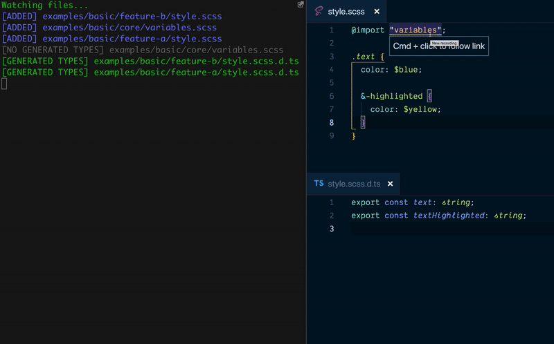

Recently, I shared [typed-scss-modules](https://github.com/skovy/typed-scss-modules), a command-line interface (CLI) for [generating type definitions for CSS Modules using SASS](/generating-typescript-definitions-for-css-modules-using-sass). I’ve used many npm packages that provide executable commands, such as `tsc` from TypeScript, or `apollo` for [Apollo GraphQL tooling](https://github.com/apollographql/apollo-tooling), but have never created a package with an executable.

Considering `typed-scss-modules` is a tool for generating TypeScript type definitions, it seemed fit to also be written in TypeScript. But where to start?

## 📦 Getting Started

After searching around and also digging through various packages that offered executables the packages below were the most helpful when creating a TypeScript command-line npm package.

### Core Tooling

Some of this tooling is specific to TypeScript, but the majority of this is useful for any npm package that includes an executable for doing things like creating the CLI options or printing formatted output.

* `ts-node`: [TypeScript Node](https://github.com/TypeStrong/ts-node) is used to execute TypeScript. This is useful in development to run the CLI without needing to build anything. Adding a custom script to `package.json` with the same name will enable executing the script the similarily during development and in the published version. For example, adding `"my-script": "ts-node ./lib/cli.ts"` to the `package.json` `scripts` property will running it with `yarn my-script` or `npm run my-script`.

* `yargs`: [Yargs](http://yargs.js.org/) helps build interactive command line tools, by parsing arguments and generating a user interface. There are also other packages like [commander.js](https://github.com/tj/commander.js) that can be used for this as well. On an unrelated note, the type definitions for yargs ([`@types/yargs`](https://www.npmjs.com/package/@types/yargs)) are impressive. They allow chaining methods that build up a final object with all of the CLI options with the proper types.

* `chalk`: [Chalk](https://github.com/chalk/chalk) provides terminal string styling to display messages in different ways depending on the context. The gif below is an example of using `typed-scss-modules` and the output, which is styled using `chalk`. If looking to create a more complex CLI, consider giving [ink](https://github.com/vadimdemedes/ink/tree/next) a try. It also may be a better fit for `typed-scss-modules` to show the total number of type definitions generated, rather than a full list of every file which could get lengthy in larger projects.


<span class="image-caption">
*Example output from `typed-scss-modules` using Chalk. See [here for more details](/generating-typescript-definitions-for-css-modules-using-sass).*
</span>

### Additional Tooling

There were some additional packages that were helpful when creating `typed-scss-modules` but may not be as useful depending on the purpose of the CLI.

* `glob`: [Glob](https://github.com/isaacs/node-glob) is useful for matching files using patterns. For example, `src/**/*.scss` will match all of the SCSS files within a project.

* `chokidar`: [Chokidar](https://github.com/paulmillr/chokidar) is a wrapper around node’s `fs.watch` but resolves some of the common problems. This was useful for implementing the watch feature seen in the gif above. *Sidenote: [it now includes type definitions](https://github.com/paulmillr/chokidar/pull/801) in the latest version!*

* `path`/`fs`: The node [path](https://nodejs.org/api/path.html) and [file system](https://nodejs.org/api/fs.html) packages were useful for working with files and directories necessary for reading, writing or finding the SCSS files.

* `css-modules-loader-core`: [CSS Module Loader Core](https://github.com/css-modules/css-modules-loader-core) is a loader-agnostic CSS Modules implementation. This was very specific to this package but was useful for generating a list of the proper class names.

* `jest`: As always, testing is important to ensure quality and avoid regressions. Using [Jest](https://jestjs.io/) as the test runner and for mocking worked well.

The list of tools here is not exhaustive, but they were the most helpful packages for creating `typed-scss-modules`.

## 🏗 Building & Publishing

For the most part, creating a CLI is the same as a standard npm package with TypeScript. However, there are a few important steps to ensure it functions properly.

In order to make the script executable as a node script, the node shebang must be added to the top of the output script file. If it’s not included, the script is started without the node executable and obscure syntax related errors will likely be thrown.

```
#!/usr/bin/env node
```

The next step is to denote that the package has an executable script. This is done by adding the [`bin`](https://docs.npmjs.com/files/package.json#bin) property to the `package.json` file. For example, assuming the compiled output file lives at `dist/cli.js` then the `bin` property can be added with the name of the script as the key.

```json
{
  "scripts": { ... },
  "bin": {
    "my-script": "./dist/cli.js"
  },
  "devDependencies": { ... },
  "dependencies": { ... }
}
```
<span class="image-caption">Example of `package.json`</span>

Finally, to test the script, run [`npm link`](https://docs.npmjs.com/cli/link.html) in the package directory. Normally to use a package, `npm link [package]` would have to be run in another directory to symlink the local copy. When working with scripts it will also symlink the `bin` globally, so running `my-script` should now work. It’s also still possible to run `npm link [package]` and locally install the `bin`.

## Conclusion

That’s all! Hopefully, these packages and key steps are useful when considering to build a command-line npm package written with TypeScript.

If you’ve created a command-line package with TypeScript or know of other helpful tools when working on a CLI please share with me on Twitter. 👇

*For more content on topics like this, React, TypeScript, JavaScript, Design Systems and more subscribe to the [Rubber Ducking](http://www.rubberducking.fm/) podcast!* 🦆