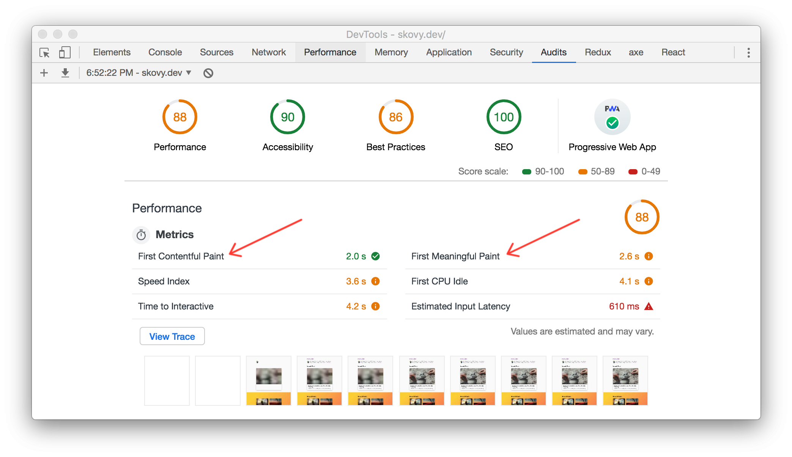
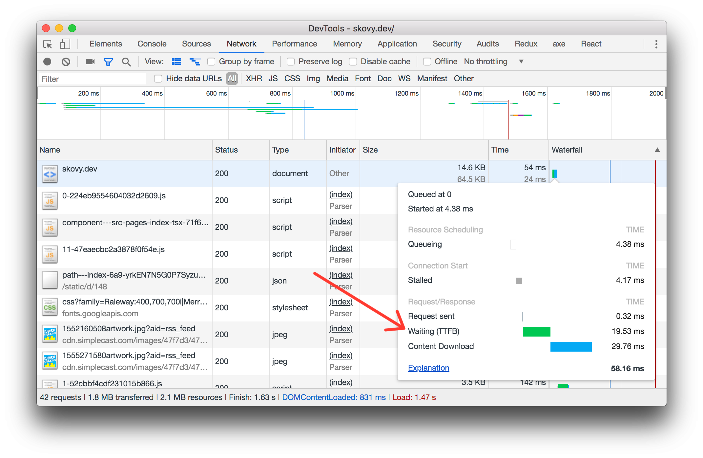
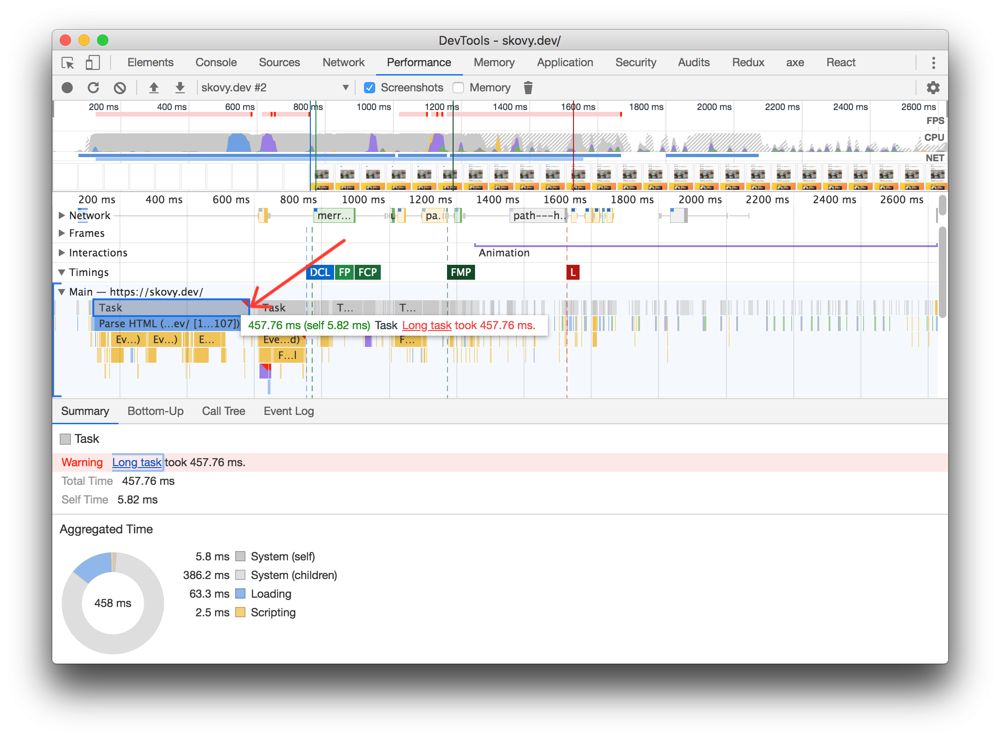

Before a few months ago I had never dug into the details of "frontend
performance," what it means, or how to measure it. I've looked at server
response time and often assumed if that was "fast" the whole user experience
would be "fast." However, there's a lot more to the performance of an application
and the overall user experience. A whole world I knew nothing about. There are
experts that know way more than I do, but this is an overview of what I learned
after a few months of trying to understand and then implement frontend
performance metrics.

### What is frontend performance?

My simplest definition is **"the time it takes for an application to become
usable."** For me, this is challenging to wrap my head around because "usable"
can be interpreted in different ways by different people _(or maybe the same
person on different days)_.

You could argue, when looking at something like server response time there's
only one definition for "is it usable?". The overall response time. Before the
server responds, it's 0% usable. The user hasn't received the data yet. Once
the server has responded it's now 100% usable for the user. With that, improving the
server response time will improve the time it takes the server to
become usable.

When looking at frontend performance it becomes less straightforward. Rarely, it's
exactly 0% or 100% usable, but rather somewhere between during an application's
life cycle. There are a large number of variables
that can affect the usability: the actual feature code efficiency (eg:
[maybe using `concat` vs `push` in a large loop](https://dev.to/uilicious/javascript-array-push-is-945x-faster-than-array-concat-1oki)),
network latency, server response time, server response size, JavaScript and CSS
file size, which browser, available resources on the client, caching,
long-running tasks, loading states, etc.

### Why care about frontend performance?

In general, better performance means a better user experience.

Unfortunately, we usually can't stop here and need to go a step further to
prove that it's a worthwhile business investment. Fortunately, a better
experience will usually lead to an increase in some important business metric.

This may mean users will spend more time using your product (if you care about
that) or maybe it means they actually spend _less_ time using your product
because they can achieve their task quickly. Later on they might recommend it to
their friend since it was a fast and delightful experience.

It's hard to generalize what exactly improving performance will lead to, but
it can generally lead to an improvement of an important business metric.

If you're looking for more concrete examples there are
[several great examples curated by Google Web Fundamentals](https://developers.google.com/web/fundamentals/performance/why-performance-matters/#performance_is_about_improving_conversions)
outlining specific examples of how performance directly improved various
important metrics for specific sites.

_([Google Web Fundamentals](https://developers.google.com/web/fundamentals/)
was an invaluable resource when investigating and learning about frontend
performance. Much of this content was inspired from their resources)_

## What should be measured?

Even though frontend performance may not be an exact science, we need something
precise to measure. Given the qualitative feedback that "the application
feels slow" how do you know it's slow and not a networking issue? Or, some other
factor? You don't. We need to measure something, but what?

Reframed in the context of the above definition: **what measurements can be made
that would determine if an application is usable?** The [Web Fundamentals](https://developers.google.com/web/fundamentals/performance/user-centric-performance-metrics)
does an excellent job outlining questions that can be related to exact numbers:
Is it happening? Is it usable? Is it delightful?

### Is it happening?

How does the user know if anything is happening when first navigating to your
application? Something visually different appears or "paints" on the screen.
There are actually three common "paint" measurements:

- [First Paint (FP)](https://developer.mozilla.org/en-US/docs/Glossary/First_paint):
  _the time it takes to render the first pixels on the screen, something visually
  different from the previous page_
- [First Contentful Paint (FCP)](https://developer.mozilla.org/en-US/docs/Glossary/First_contentful_paint):
  _the time it takes to render the first element or piece of content_
- [First Meaningful Paint (FMP)](https://developer.mozilla.org/en-US/docs/Glossary/first_meaningful_paint):
  _the time it takes the most important content to load, often referred to as
  the hero content_



<span class="image-caption">
First Contentful Paint (FCP) and First Meaningful Paint (FMP) in Lighthouse
</span>

Another metric that I also found helpful to provide a full perspective was
[Time to First Byte (TTFB)](https://developer.mozilla.org/en-US/docs/Glossary/time_to_first_byte):
_the time it takes from the start of the request to receiving the first byte_.
From the frontend perspective, this is where you can start to control the
performance experience. Before this point is the DNS lookup, request overhead,
server time, network latency, etc. (all things out of the control of the frontend).
It's also straightforward to calculate using the
[`Performance​Navigation​Timing` API](https://developer.mozilla.org/en-US/docs/Web/API/PerformanceNavigationTiming).

The Time to First Byte timing is also visible in the Chrome Devtools under the Network
tab.



<span class="image-caption">
Time to First Byte (TTFB) in Chrome Devtools
</span>

### Is it usable?

The user is aware it's happening, they can see something visually on the screen
but there's like a button, a link or some other interaction. Presumably, they'll
want to click or interact with the page in some way. But, can they?

- [Time to Interactive (TTI)](https://developer.mozilla.org/en-US/docs/Glossary/Time_to_interactive):
  _the time is takes for the application to render and be ready to handle user input_

This metric is more complicated and relies on a few criteria. First, the application
is rendered so by definition it's always after the First Paints. Second, it's
"ready" to handle user input.

What does "ready" mean? For Time to Interactivity, it's measured as the first
time the main thread _will be_ inactive for 5 seconds meaning that any user
input could be handled. It can be a bit tricky to understand since we have to
wait 5 seconds to see if that given point was followed by 5 seconds of inactivity.
Time to Interactive is not a standardized performance metric and requires using
the Long Running Task API _(see below for more details)_.


<span class="image-caption">
Time to Interactive (TTI) in Lighthouse
</span>

### Is it delightful?

I like to think about all of the previous metrics as snapshots along a timeline.
First Paint has to happen before First Contentful Paint. Both have to happen
before Time to Interactive. But what about the prolonged usage of the
application after the initial load? There are two more measurements that can
help answer this question:

- [Long Running Task](https://developer.mozilla.org/en-US/docs/Web/API/Long_Tasks_API):
  _a long running task is anything task that takes longer than 50 milliseconds to complete_
- [First Input Delay](https://developer.mozilla.org/en-US/docs/Glossary/First_input_delay):
  _the time it takes from the user interacting (eg: clicking a button) to when the
  browser responds_

The Long Running Tasks are used to calculate the Time to Interactive, but they can
also be measured on their own. Anytime there is a Long Running Tasks it could
potentially impact the user's experience. The threshold is 50 milliseconds
because anything above 100 milliseconds will not feel immediate and could
be felt as delayed.



<span class="image-caption">
Example of a Long Running Task in Chrome Devtools
</span>

The First Input Delay compliments the Time to Interactive measurement, but the
difference is that the First Input Delay actually requires a user to interact
with the page. Each measurement is an actual length of time that a user had
to wait for the browser to handle their interaction. First Input Delay can
happen at any point, not at a set point along the timeline like the earlier
metrics.

## How should it be measured?

In general, there are two approaches: "lab" tools and "real world" tools.
You can think of lab tools as those you run on a local computer (or on a small
sample) to get a general idea of how the application is performing. The numbers
are not exact since there can be a large amount of variability depending on
client devices, network connections, etc. To collect a representative example
the metrics need to be collected in the real world, often referred to as
Real User Monitoring (RUM). This approach uses browser APIs to collect and
report these metrics to a tool like Google Analytics or maybe a custom
setup like Datadog.

### Lighthouse

[Lighthouse](https://developers.google.com/web/tools/lighthouse/) is a tool
available in Chrome Devtools _(screenshots above)_ under the Audits tab. It's
also available as a node module to run in other environments like CI. It provides
insights into many of these performance metrics, some additional ones as well
as other useful information such as accessibility or approaches to improve the
performance of your application. Again, this is an excellent tool to get a
general idea of the overall performance or where the bottlenecks might be.
However, if you want to quantitatively discuss the performance of your application
you'll need to implement Real User Monitoring.

### Browser APIs & Polyfills

This post covers the browser APIs (in modern browsers) and polyfills available
to implement and measure the frontend performance of an application. There are
also several paid solutions or open source packages. As with most decisions,
you'll have to decide if the costs and benefits are worth using one of these
tools or reaching for the browser APIs.

#### Measuring Time to First Byte (TTFB)

Measuring Time to First Byte is the easiest metric to collect.

To start, most of these metrics rely on the [Performance API](https://developer.mozilla.org/en-US/docs/Web/API/Performance)
either directly or as part of the computation for a metric. To measure the time
it takes to receive the first byte of data from the server we need to know
the **difference between when the response started and when the request started**.

This data is part of the [Navigation Timing API](https://developer.mozilla.org/en-US/docs/Web/API/PerformanceNavigationTiming).
It can be retrieved by pass the [`entryType` of `navigation`](https://developer.mozilla.org/en-US/docs/Web/API/PerformanceEntry/entryType#Performance_entry_type_names)
to the [`getEntriesByType`](https://developer.mozilla.org/en-US/docs/Web/API/Performance/getEntriesByType)
function available on the performance object. To put this into code:

```typescript
// Get the performance entry for the browser navigation events
const pageNav = performance.getEntriesByType("navigation")[0];

// Calculate the time it took to receive the first byte
const durationMs = pageNav.responseStart - pageNav.requestStart;
```

If using TypeScript, it may be necessary to cast `pageNav` to `PerformanceNavigationTiming`.

#### Measuring First Paints (FP & FCP)

Fortunately, there is also a browser API for tracking First Paint and First Contentful
Paint but it's slightly more involved. The same approach be used above but passing
the [`entryType` of `paint`](https://developer.mozilla.org/en-US/docs/Web/API/PerformanceEntry/entryType#Performance_entry_type_names)
to `getEntriesByType`.

```typescript
performance.getEntriesByType("paint");
```

However, if this is added in the `head` (or early) in the document, it may
return `[]` (an empty array) if invoked before the `first-paint` or
`first-contentful-paint` entries exist. This is where the
[`PerformanceObserver`](https://developer.mozilla.org/en-US/docs/Web/API/PerformanceObserver)
can be useful. It will observe performance events and can invoke a callback when
a specific event occurs. However, this can have the _opposite_ problem if the
observer is created after the paint events have occurred the callback will never
be invoked. This will no longer be a problem once the `PerformanceObserver`
accepts the [`buffered`](https://w3c.github.io/performance-timeline/#dom-performanceobserverinit-buffered)
parameter. Until then, ensure `PerformanceObserver` is initialized as early as
possible, such as in the head of the document.

```typescript
(() => {
  // Early return in browsers that don't support the paint 
  // timing API. This also assumes if the browser supports 
  // the PerformancePaintTiming API it also supports the 
  // PerformanceObserver API.
  if (!("PerformancePaintTiming" in window)) {
    return;
  }

  const observer = new PerformanceObserver(list => {
    for (const entry of list.getEntries()) {
      // The `PerformanceEntry` has a `startTime` and 
      // `duration` attribute. Usually, these need to 
      // be subtracted but `duration` is always `0`. 
      // Round to the nearest whole millisecond.
      const durationMs = Math.round(entry.startTime);

      // `entry.name` will be either `first-paint` 
      // or `first-contentful-paint`. Log or track 
      // `entry.name` and `durationMs`
      console.log({ name: entry.name, durationMs });
    }
  });

  observer.observe({ entryTypes: ["paint"] });
})();
```

If looking to measure First Meaningful Paint
that will likely need to be a custom implementation since that depends on the
specific application and what is considered the most important content. Check
out the [Performance `mark` API](https://developer.mozilla.org/en-US/docs/Web/API/Performance/mark)
for one possible approach for the custom performance measurement.

#### Measuring Time to Interactive (TTI)

#### Measuring First Input Delay (FID)

## Conclusion

Remember, these APIs are not available in all browsers so make sure to verify
they exist before using them to avoid errors in older browsers.

Interested in learning more? Listen to this
[recent episode on Rubber Ducking about frontend performance](https://rubberducking.fm/15),
read [Google Web Fundamentals](https://developers.google.com/web/fundamentals/),
or reach out on [Twitter](https://twitter.com/spencerskovy).
