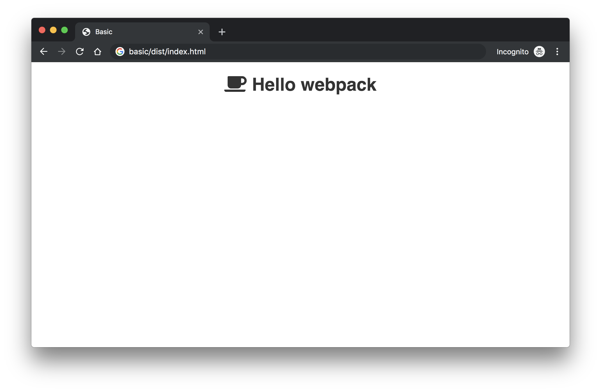
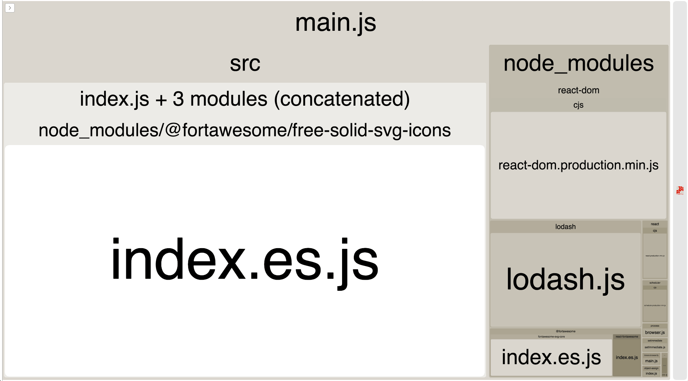
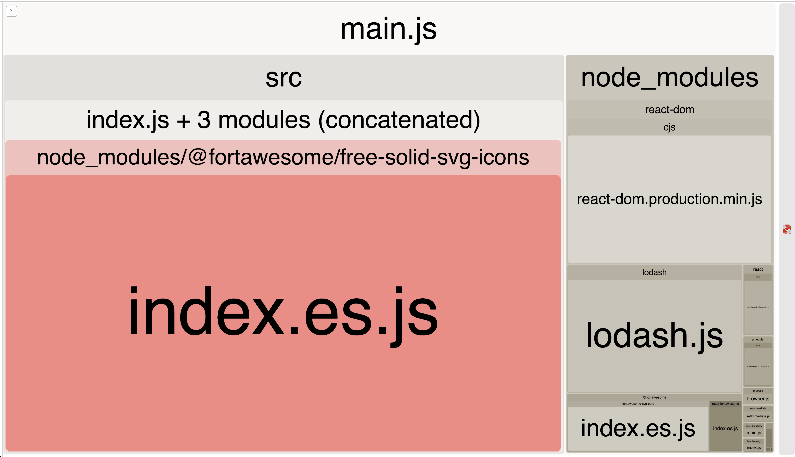

Tree shaking: a word that at first sounds like another convoluted
term used to describe some obscure technology or pattern. After rephrasing it as
"dead code elimination," I find tree shaking to actually be a strong metaphor
for what it describes.

Imagine building a large application and over time many packages are added as
dependencies. Some of these packages provide utility methods, like the
[`intersection`](https://lodash.com/docs/4.17.15#intersection) method from
[`lodash`](https://lodash.com/) or [`underscore`](https://underscorejs.org/).
Then there's more packages that provide some UI components like
[Evergreen UI](https://evergreen.segment.com/), [Semantic UI](https://react.semantic-ui.com/),
[React Bootstrap](https://react-bootstrap.github.io/) or one of the many others.
And finally, maybe some icons provided by [Font Awesome](https://fontawesome.com/).

Relying on these packages saves a lot of time but if not monitored closely,
the bundle size can start to explode resulting in shipping **many megabytes** of
JavaScript and other assets to a user's browser. It not only takes a long time
to download (especially on slower connections) but now the browser has to parse
and compile all that code which can add signifigant time (especially on devices
that may not have a lot of resources).

There are a few options. First, it's possible a user doesn't need all that code
immediately. The bundle could be code split into smaller chunks so a user
only has to download the code they need for the current page or feature they
are interacting with. However, even with code splitting, if there are a lot
of dependencies a user still has to download a lot of code on the initial load.
But do they _need_ all those dependencies? The simple answer is usually yes.
The first page requires a utility method, and a UI component and an icon so all
those dependencies need to be loaded. But the more complex and nuanced answer is
usually no.

Across the whole application, maybe only 10% of the utility methods are used,
80% of the UI components and 20% of the icons. Each dependency is necessary but
not **all** the utility methods, components and icons from those packages.

That means 90% of the utility methods, 20% of the UI components and 80% of the
icon code that is being delivered to users is "dead code." Dead code is code
that is included but never ran. Ideally, this dead code can be eliminated. It
not only consumes more bandwidth and adds latency, it also adds times to
decompressing, parsing, compiling and other processing the client has to do
after it's been downloaded. This also means that during build time, it takes longer
to minify, build sourcemaps, compress and any other sort of preprocessing that
takes place.

Eliminating dead code is pretty straightforward in application code that you write.
If a feature or component is unused, delete it. But how does this work with an
external package? Isn't that all or nothing? It's either in `package.json` as a
dependency or it's not?

## 🌳 Tree Shaking

As of version 2, webpack supports tree shaking. It requires the
packages to be properly configured and built to allow tree shaking. Tree shaking
is performed automatically by webpack in production mode. When it does work, it
hopefully looks something like this.


All of those utilities, components, icons and whatever else isn't used
in the application bundle ("the tree") are entirely removed ("the falling
almonds") so what is left is a much smaller and lighter application bundle
("the tree").

Although webpack is configured to perform tree shaking by default, it's often
easy to "break" by using a package with the wrong configuration or
not producing the right output or importing more than actually needed.

It can be challenging to know what is dead code and where to look. The first
step is to understand _what_ the application bundle looks like.

### Visualizing the bundle

Let's look at a basic app that is built with webpack and has a few dependencies:
React, lodash and Font Awesome.



There's a simple heading, that renders a single Font Awesome icon
_([see the source for the `basic` example here](https://github.com/skovy/webpack-tree-shaking-demo))_.
When building this example, the output from webpack includes these warnings:

```
WARNING in asset size limit: The following asset(s) exceed the recommended size limit (244 KiB).
This can impact web performance.
Assets:
  main.js (819 KiB)

WARNING in entrypoint size limit: The following entrypoint(s) combined asset size exceeds the recommended limit (244 KiB). This can impact web performance.
Entrypoints:
  main (819 KiB)
      main.js


WARNING in webpack performance recommendations:
You can limit the size of your bundles by using import() or require.ensure to lazy load some parts of your application.
For more info visit https://webpack.js.org/guides/code-splitting/
```

What is it actually saying? By default, webpack will
warn if any of the produced output assets exceed 244 Kilobytes in size. Here,
the `main.js` output file was 819 Kilobytes. More than 3x the recommended size!

As the warnings suggest, code splitting could be used to split this single `main.js`
bundle into multiple smaller chunks. This can help with interactivity by breaking
up a single large bundle. However, that papers over the issue and
doesn't solve the core problem. There likely is a _ton_ of dead code that is
never used in an app that is this simple (rendering a single icon within a heading).
But where is the dead code? We could try digging through the webpack output
line-by-line, or start inspecting the packages in `node_modules` but that would
be like looking for a needle in a haystack if you don't know what exactly it is
your looking for.

Fortunately, we don't have to do that because there's the
[`webpack-bundle-analyzer`](https://github.com/webpack-contrib/webpack-bundle-analyzer)
plugin that visualizes the built bundle. It's an invaluable tool to understand
the cost of including a package and determining the biggest opportunities.

To setup the `webpack-bundle-analyzer`, first install it:
`yarn add -D webpack-bundle-analyzer`. Then, include it in the webpack configuration.

```javascript{1-2,8}
const BundleAnalyzerPlugin = require("webpack-bundle-analyzer")
  .BundleAnalyzerPlugin;

module.exports = {
  // Other configuration ...
  plugins: [
    // Other plugins ...
    new BundleAnalyzerPlugin()
  ]
};
```

After running webpack, by default it should open in the browser with a visualization
of the bundle. For the above example app, it will look something like the following.


<span class="image-caption">
Example of the webpack bundle analyzer in a simple app.
</span>

At a closer look, the `@fortawesome/free-solid-svg-icons` package accounts for
655 Kilobytes out of the total 818 Kilobytes. 80% of the output bundle is the
icons!



But in the screenshot of the basic app above there's only one icon. Now you
might start questioning if the icons are _really_ necessary with such a high
cost and consider removing them entirely. What if there was a way to only include
the icons that are actually being used?

_Keep in mind that a development build often will produce different output than
the production build. If looking to see exactly what will be produced in
production make sure to run in production mode when using the bundle analyzer._

### "Enabling" tree shaking with webpack

Enabling is in quotes here because all the options to enable tree shaking are on
by default when working with webpack. However, as mentioned earlier
it's very easy to "break" (disable) tree shaking and accidentally include a lot
of dead code.

The first step is to ensure webpack is properly configured. The
`optimization.usedExports` setting needs to be enabled.

```javascript{3-5}
module.exports = {
  // Other configuration ...
  optimization: {
    usedExports: true
  }
};
```

Running this in development mode (`mode: "development"`) with the example app
will produce output with nearly 1000 comments that resemble something like this.

```javascript
/* unused harmony export faAddressBook */
/* unused harmony export faAlignCenter */
/* unused harmony export ... */
```

So enabling `usedExports` added all these comments highlighting unused exports
but they all still exist. It's the job of the minifier to actually remove these
unused exports. Now the minifier needs to be configured and enabled.

Rather than configuring this, running webpack in production mode (`mode: "production"`) will
automatically enable `usedExports` and enable the minifier _(which is one of the
many reasons properly configuring the `mode` is important)_. But even with these
changes all the icons are still being included?

The problem in this example is with how the Font Awesome library is being used.

## Font Awesome

The following lines can be found looking at the [source](https://github.com/skovy/webpack-tree-shaking-demo/blob/master/basic/src/index.js#L9)
of the example app.

```javascript
import { library } from "@fortawesome/fontawesome-svg-core";
import { fas } from "@fortawesome/free-solid-svg-icons";

library.add(fas);
```

This is using Font Awesome's [SVG Core](https://fontawesome.com/how-to-use/on-the-web/advanced/svg-javascript-core)
to add _all_ the solid icons (`fas`) to the library. This means that any icon
can be referenced as a string if using the React Font Awesome components.

```javascript
<FontAwesomeIcon icon="coffee" />
```

As mentioned, tree shaking was actually enabled the entire time but it was "broken"
by the way Font Awesome was setup. How is webpack supposed to determine that we're
only using the `"coffee"` icon but none of the others when _all_ of the `fas` icons
are being imported? It can't.

There are a handful of options. First, the `library.add` can be updated to include
only the icons we know will be used. The above library setup code would look like
this. Now, _only_ the `"coffee"` icon is included which brings the size of code
from the `@fortawesome/free-solid-svg-icons` package **down to roughly 1 Kilobyte**
(over a 99% reduction).

```javascript{2,4}
import { library } from "@fortawesome/fontawesome-svg-core";
import { faCoffee } from "@fortawesome/free-solid-svg-icons";

library.add(faCoffee);
```

Great! Problem solved. This might work great to start, but this can quickly
suffer from the common over-including/under-including problem ever-present in
frontend development.

What happens if we decide to add a new icon? This call now needs to be updated
with one more icon and if it's forgotten that icon won't render (under-included).
What if you remove the usage of the `"coffee"` icon but forget to remove it
from the library (over-included). Are you _sure_ it's not used anywhere else?
This can quickly become a maintenance nightmare in a large codebase. It would be
great to automatically include the exact icons used (not less, not more).

This is where webpack's automated tree shaking can really shine ✨. In order to
leverage webpack, the usages need to be explicit so it can properly determine
what is and isn't used. With this approach, the `library.add` setup needs to be
removed entirely. Now, the icons need to be explicitly imported. The above
`FontAwesomeIcon` example would become the following.

```javascript
import { faCoffee } from "@fortawesome/free-solid-svg-icons";

<FontAwesomeIcon icon={faCoffee} />;
```

Now, only the icons that are used are being explicitly imported. If this icon
is removed and it's not used anywhere else it will not longer be bundled. When
new icons are imported, they'll automatically be included.

_See the [Font Awesome docs](https://fontawesome.com/how-to-use/with-the-api/other/tree-shaking)
for more details on working with Font Awesome, tree shaking or deep importing
if using a tool other than webpack._

_See the source for all these [examples in this repository](https://github.com/skovy/webpack-tree-shaking-demo)._

## How is this working?

There are often many pieces that need to come together for tree shaking to
properly work. If only one of the steps is missing the dead code cannot be
eliminated. These are some of the important steps to keep in mind:

- webpack needs to be running in production mode (or have the right configuration).
- Imports should be explicit and only use what's need (avoid `import *` or
  values that import unused things like `fas`)
- The package likely needs `sideEffects` defined in the `package.json` and to be
  built with ES Modules. If you're a library author consider
  properly configuring any files that have `sideEffects` or also building ES
  Modules as part of the distribution with a tool like `rollup`.

The [tree shaking documentation](https://webpack.js.org/guides/tree-shaking)
provides a great overview on the usage of `sideEffects`, `usedExports` and how the
minifier (`terser`) come into play,

## Other Considerations

### Keep packages updated

For example, if using a package like `react-bootstrap` upgrading from version
[`0.32.1`](https://unpkg.com/react-bootstrap@0.32.1/package.json) to version
[`0.32.2`](https://unpkg.com/react-bootstrap@0.32.2/package.json) could have
started tree shaking (assuming only explicit components were imported) because
of the `"sideEffects": false` option being set. Another reason to keep packages
up to date. Unfortunately, some packages are distributed in a way that does not
allow tree shaking, such as [`@blueprintjs/icons`](https://unpkg.com/@blueprintjs/icons@3.9.1/lib/esm/generated/iconSvgPaths.js)
_(as of version `3.9.1`)_ because _all_ the icons are a single export.

### Tooling for automating code modifications

In the above example, the original code referenced the icon by it's string name.

```javascript
<FontAwesomeIcon icon="coffee" />
```

That code had to be converted to an explicit import to enable tree shaking.

```javascript
import { faCoffee } from "@fortawesome/free-solid-svg-icons";

<FontAwesomeIcon icon={faCoffee} />;
```

At first glance, this seems fairly straightforward. However, if using Font Awesome
in a larger codebase for some duration of time there likely are hundreds or
thousands of usages. Updating each one individually is not only manual but
also fairly error prone. This is where a tool like
[`jscodeshift`](https://github.com/facebook/jscodeshift) can become useful to
automate these changes with a custom transform.

## Conclusion

If working in an app that produces a large bundle, the first step to understanding
where the problem is to use a tool like the webpack bundle analyzer to visualize
the output. It can be an invaluable tool for surfacing opportunities for
decreasing bundle size. Decreasing bundle size might mean removing a dependency
altogether, swapping it out for a smaller replacement or exploring patterns like
code splitting to minimize it's impact. 

However, many times only pieces of that
dependency are needed and the rest is "dead code" that can be eliminated. More
times than not there's only one issue blocking tree shaking: a webpack
misconfiguration, a package missing the `sideEffects` attribute, an outdated
package, a single import that is importing everything or maybe a library that
could be distributed with ES Modules. Whatever the solution is, tree shaking is
a great tool for minimizing the overall footprint of an app.
